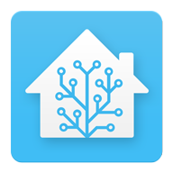
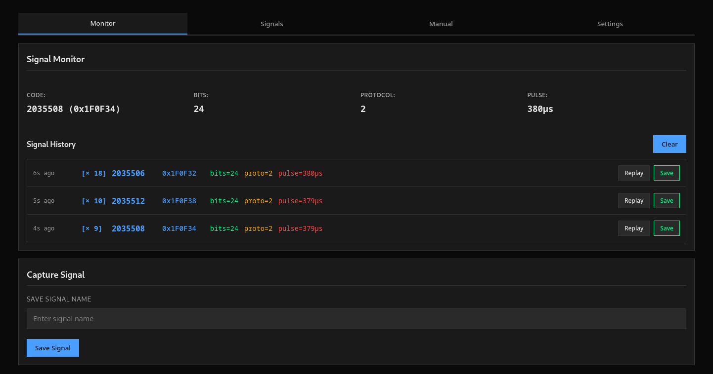
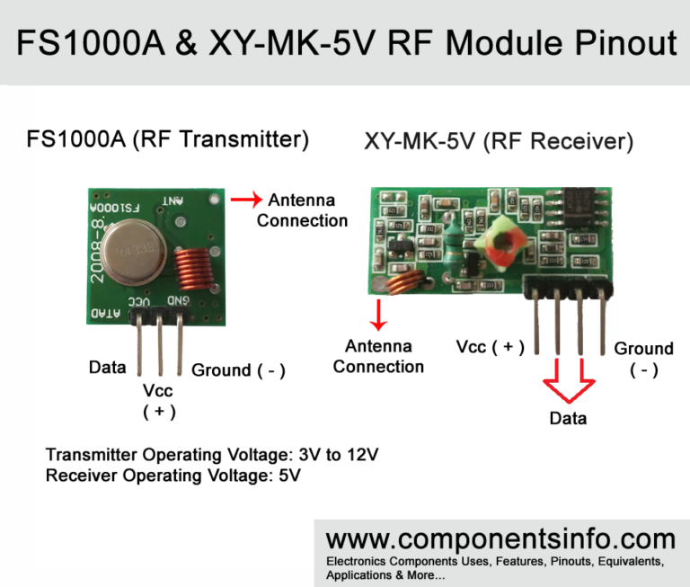
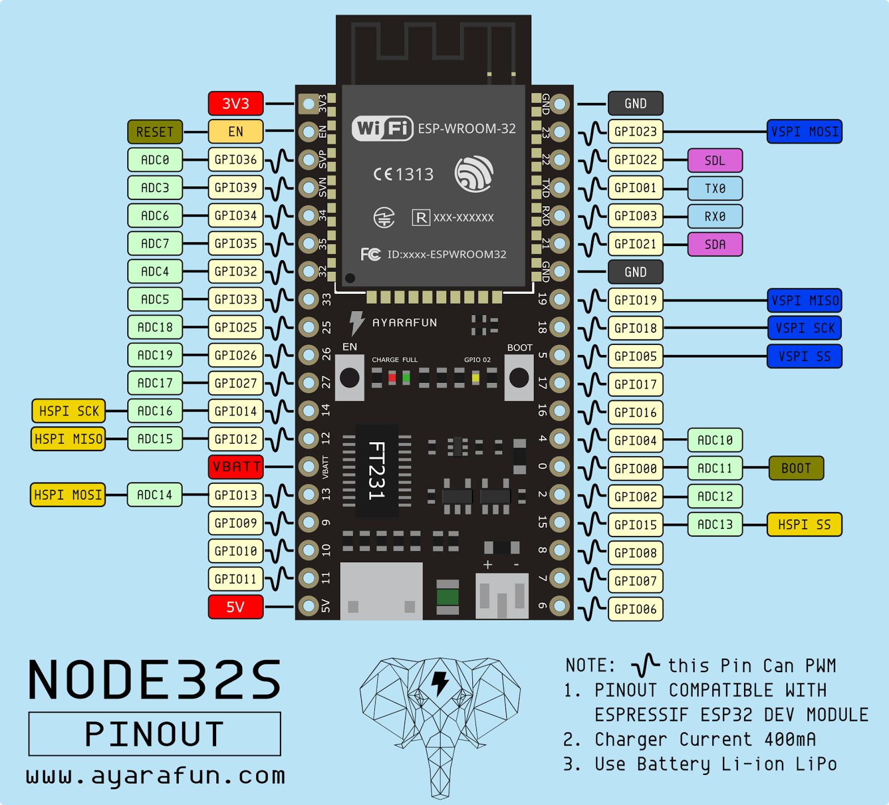
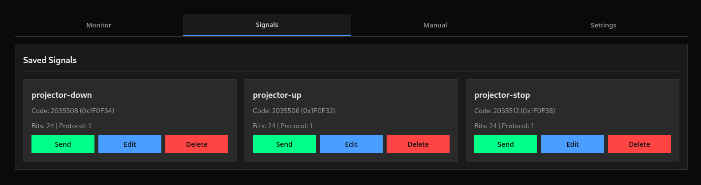
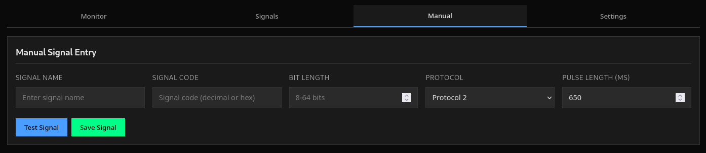
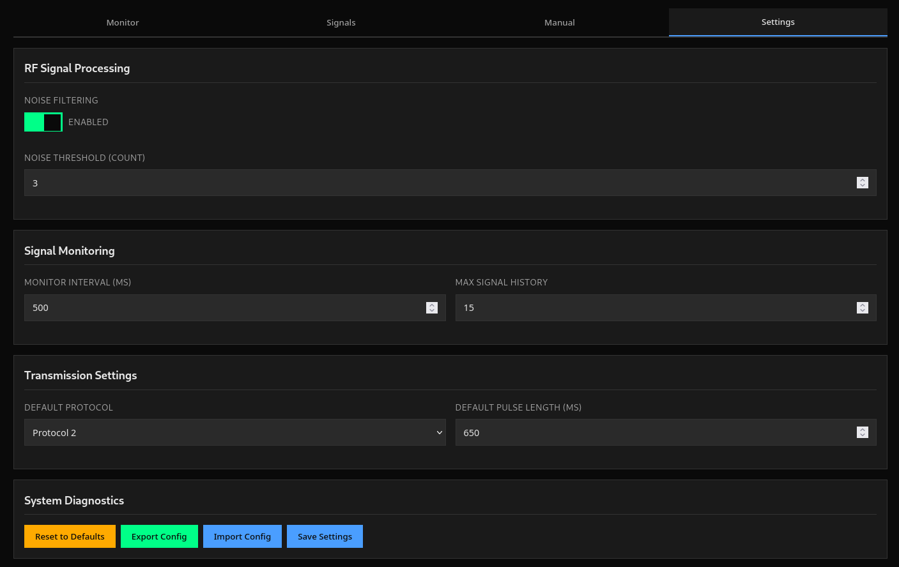

# ESP32 433MHz RF Controller

Capture, store, and replay 433MHz RF signals with ESP32 using a web interface and REST API. Easily integrates with Home Assistant and other automation tools.

<div>
  
  
</div>

> Works like the Flipper Zero's SubGHz module, but with a modern web interface and REST API.



## Table of Contents

- [Features](#features)
  - [Why Are Some Features Not Planned? ❌](#why-are-some-features-not-planned-❌)
- [Hardware Requirements 🔌](#hardware-requirements-)
- [GPIO Connections](#gpio-connections)
  - [Pin Connections](#pin-connections)
  - [General Setup Notes](#general-setup-notes)
- [Setup and Compilation ⚙️](#setup-and-compilation-)
  - [Prerequisites](#prerequisites)
  - [Configuration](#configuration)
  - [Build and Flash](#build-and-flash)
  - [Access the Web Interface](#access-the-web-interface)
- [Web Interface 🌐](#web-interface-)
  - [Monitor Tab](#monitor-tab)
  - [Signals Tab](#signals-tab)
  - [Manual Tab](#manual-tab)
  - [Settings Tab](#settings-tab)
- [API Documentation 📚](#api-documentation-)
- [Development](#development)
  - [Project Structure](#project-structure)
  - [Building](#building)
- [Contributing 🤝](#contributing-)

## Features

| Feature                         | Description                                              | Status   |
|---------------------------------|----------------------------------------------------------|----------|
| **Live Signal Capture**         | Watch 433MHz RF signals appear instantly                 | ✅        |
| **One-click Replay**            | Instantly resend any signal                              | ✅        |
| **Safe Storage**                | Signals saved even after reboot                          | ✅        |
| **History & Library**           | View, save, edit, or delete signals easily               | ✅        |
| **REST API**                    | Automate with Home Assistant or other tools              | ✅        |
| **Easy Settings**               | Tweak everything via the web interface                   | ✅        |
| **Manual Entry**                | Add your own custom signals                              | ✅        |
| **Smart Filtering**             | Reduces noise and false positives                        | ✅        |
| **Signal Labeling**             | Attach meaningful names and tags to signals              | 🔜 Planned |
| **Multi-frequency Support**     | Work with additional frequencies (315/868MHz, etc.)      | 🔜 Planned |
| **Access Control**              | Limit access to the web interface behind a username, password and API key       | 🔜 Planned |
| **Signal Analytics**            | Visualize signal usage stats and patterns                | 🔜 Planned |
| **Schedule Automation**         | Trigger specific RF signals on a schedule                | ❌ Not Planned |
| **Over-the-Air Firmware Updates** | Update device firmware wirelessly from the web interface | ❌ Not Planned |
| **Cloud Integration**           | Direct connection to third-party cloud services          | ❌ Not Planned |
| **Voice Assistant Support**     | Native Alexa/Google Assistant integration                | ❌ Not Planned |

### Why Are Some Features Not Planned? ❌

Some features, such as voice assistant support, cloud integrations, and OTA updates, are marked as `❌ Not Planned` to keep the project simple, stable, and easy to maintain. These advanced features add complexity and require significant development time. Most of their functionality can still be achieved by integrating the REST API with tools like Home Assistant.

If you need a feature that’s not planned, there’s a good chance you can build it yourself on top of the provided APIs!

## Hardware Requirements 🔌

- ESP32 DevKit (any variant)
- 433MHz RF Receiver Module
- 433MHz RF Transmitter Module
- Breadboard and jumper wires (optional)

This project was tested with **FS1000A RF Transmitter** and **XY-MK-5V RF Receiver** modules. These are affordable, widely available, and work well with the ESP32. They typically run on 5V, but some variants can operate at 3.3V (check your module specs).



## GPIO Connections



### Pin Connections

- **RF Receiver Module**
  - **VCC**: Connect to 3.3V or 5V* pin on the ESP32 (check your module’s voltage requirements)
  - **GND**: Connect to any ground (GND) pin on the ESP32
  - **DATA**: Connect the data pin to **GPIO 4** on the ESP32.  
    > **Note:** Many RF receiver modules come with 2 DATA pins. If you're unsure which to use, simply try one; if it doesn't work, switch to the other.

- **RF Transmitter Module**
  - **VCC**: Connect to 3.3V or 5V* pin on the ESP32 (reference your module specs)
  - **GND**: Connect to any ground (GND) pin on the ESP32
  - **DATA**: Connect to **GPIO 2** on the ESP32

> *Many cheap 433MHz modules require 5V for best performance, but some can operate at 3.3V. Double-check before powering to avoid damage to your ESP32.*

### General Setup Notes

- Use short jumper wires for cleaner signals.
- Adding a short antenna (17-23 cm wire) to the ANT pin on each module will significantly improve range and reliability.
- Some ESP32 boards label GPIO numbers as “Dxx” or have different layouts, always confirm with your board’s pinout reference.

For additional guidance, refer to the included ESP32 DevKit pinout diagram and your RF module datasheets. Incorrect connections may result in unreliable operation or hardware damage.

## Setup and Compilation ⚙️

### Prerequisites

1. **Install ESP-IDF v5.5**
   - Follow the [official ESP-IDF installation guide](https://docs.espressif.com/projects/esp-idf/en/latest/esp32/get-started/)
   - Ensure `idf.py` is available in your PATH

2. **Clone the Repository**
   ```bash
   git clone https://github.com/Zebratic/esp32-433mhz-rf-controller.git
   cd esp32-433mhz-rf-controller
   ```

### Configuration

1. **Configure WiFi Credentials**
   - Copy the example WiFi config file:
     ```bash
     cp main/wifi_config.h.example main/wifi_config.h
     ```
   - Edit `main/wifi_config.h` with your WiFi credentials:
     ```c
     #define WIFI_SSID      "YourWiFiSSID"
     #define WIFI_PASS      "YourWiFiPassword"
     #define MAX_RETRY      10
     ```
   - Note: `wifi_config.h` is git-ignored to protect your credentials

### Build and Flash

1. **Build the Project**
   ```bash
   ./build.sh build
   ```

2. **Flash to ESP32**
   ```bash
   ./build.sh flash
   ```
   Or manually:
   ```bash
   idf.py -p /dev/ttyUSB0 flash monitor
   ```
   Replace `/dev/ttyUSB0` with your ESP32's serial port.

### Access the Web Interface

- The ESP32 will print its IP address to the serial monitor
- Open a browser and navigate to `http://<esp32-ip-address>`
- Example: `http://192.168.1.100`

## Web Interface 🌐

The web interface provides four main tabs:

### Monitor Tab
- Real-time display of captured RF signals
- Shows signal code, hex representation, bit length, protocol, and pulse length
- Relative timestamps showing when signals were detected
- Quick replay and save buttons for each detected signal

### Signals Tab

- View all saved signals with their names
- Edit signal names
- Delete signals
- Transmit saved signals

### Manual Tab

- Manually create signals by entering code, bit length, protocol, and pulse length
- Test transmission of custom signals

### Settings Tab

- Configure various settings
- Settings are saved to browser's local storage

## API Documentation 📚

The ESP32 provides a RESTful API for programmatic control. All endpoints return JSON responses.

**Available Endpoints:**
- `GET /api/info` - Get device information and status
- `GET /api/signal-history` - Get all tracked signals and latest detected signal
- `GET /api/signals` - Get all saved signals
- `POST /api/signals` - Save a new signal
- `PUT /api/signals/{index}` - Update a signal's name
- `DELETE /api/signals/{index}` - Delete a saved signal
- `POST /api/transmit` - Transmit a signal directly (without saving)
- `POST /api/transmit/{index}` - Transmit a saved signal by index
- `POST /api/transmit/name/{name}` - Transmit a saved signal by name
- `POST /api/clear-tracking` - Clear all tracked signal history
- `POST /api/settings` - Save application settings

For detailed API documentation with request/response examples, see the **API** tab in the web interface.

## Development

### Project Structure

```
esp32-433mhz-rf-controller/
├── main/
│   ├── main.c              # Main application code
│   ├── CMakeLists.txt     # Build configuration
│   ├── wifi_config.h      # WiFi credentials (git-ignored)
│   └── web/               # Embedded web interface
│       ├── css/           # Stylesheets
│       ├── js/            # JavaScript modules
│       └── tabs/          # Tab HTML templates
├── components/
│   └── rc_switch/         # RC switch library
├── images/               # Documentation images
├── build.sh              # Build script
└── README.md             # This file
```

### Building

The `build.sh` script handles ESP-IDF environment setup and building:

```bash
./build.sh build                # Only build the project
./build.sh flash [port]         # Build and flash to ESP32
./build.sh monitor [port]       # Only open serial monitor
./build.sh flash monitor [port] # Build, flash, and open serial monitor
./build.sh clean                # Clean build files
./build.sh menuconfig           # Open ESP-IDF configuration menu
```

**Pro Tip:** Press `Ctrl + T` & `Ctrl + X` to exit the serial monitor.

## Contributing 🤝

Contributions are welcome! Please feel free to submit a Pull Request.
